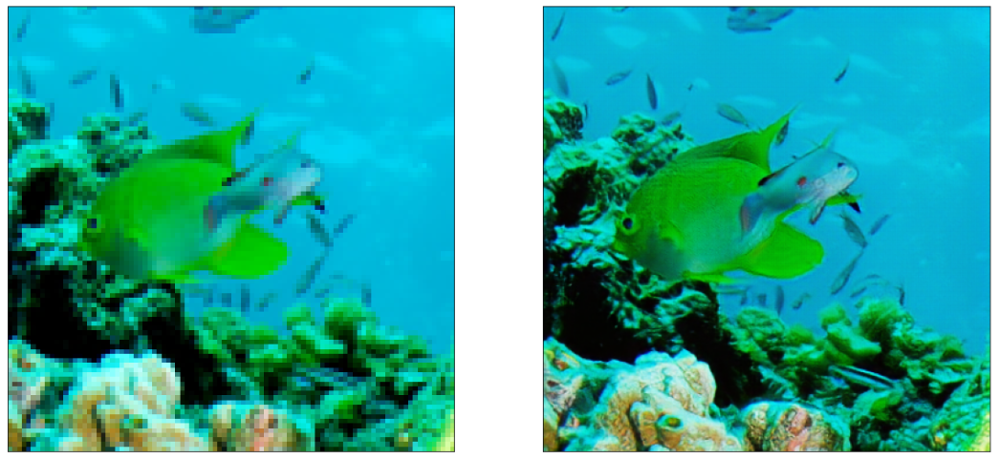

# SRGAN

Tensorflow 2.1 based [Super-Resolution Generative Adversarial Network (SRGAN)](https://arxiv.org/abs/1609.04802)

# Requierment
- tensorflow==2.1.0
- python=3.6

# Dataset
You can download DIV2K dataset from [DIV2K dataset](https://data.vision.ee.ethz.ch/cvl/DIV2K/)

800 high quality and low quality images are used to train the model

# Train
```python
python main.py
```

# Demo
```python
import numpy as np
import matplotlib.pyplot as plt

from PIL import Image
from model import generator


def super_resolution(model, lr):
    lr = tf.cast(tf.expand_dims(lr, axis=0), tf.float32)
    sr = model(lr)
    sr = tf.clip_by_value(sr, 0, 255)
    sr = tf.round(sr)
    sr = tf.cast(sr, tf.uint8)
    
    return sr[0]

model = generator()
model.load_weights('weights/gan_generator.h5')

lr_img = np.array(Image.open("./sample.png"))
hr_img = super_resolution(model, lr_img)

plt.figure(figsize=(20, 10))

imgs = [lr, sr]

for i, img in enumerate(imgs):
        plt.subplot(1, 2, i+1)
        plt.imshow(img)
        plt.xticks([])
        plt.yticks([])
```


# Reference
The entire project was referenced to the [krasserm/super-resolution](https://github.com/krasserm/super-resolution) repositories.
